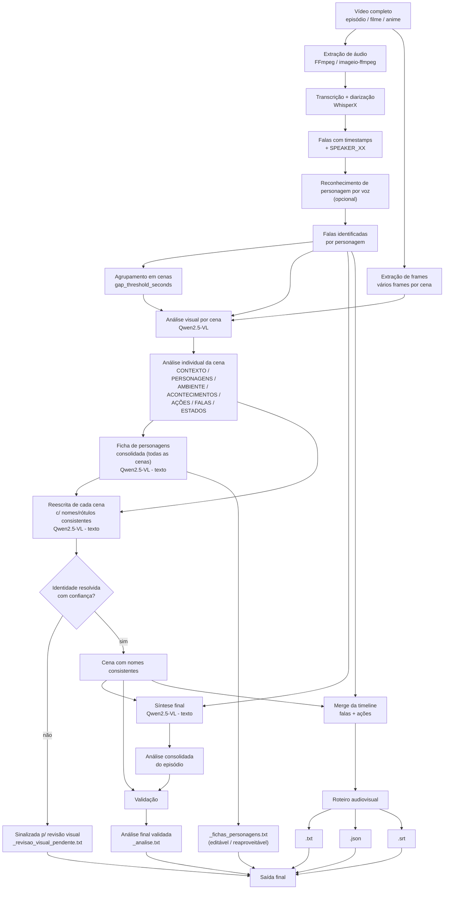

# Pipeline do Transcritor de Episódios

## Visão geral

O pipeline transforma um episódio ou vídeo completo em um roteiro
audiovisual, combinando **falas**, **informações dos personagens**,
**ações**, **ambientes**, **eventos visíveis** e uma **análise
consolidada do episódio** — com uma etapa de **consistência de
personagens entre cenas** garantindo que o mesmo personagem seja
nomeado da mesma forma do início ao fim.



## Fluxo detalhado

```text
┌─────────────────────────────────────────────────────────────┐
│                    VÍDEO COMPLETO                           │
│                episódio / filme / anime                     │
└─────────────────────────────┬───────────────────────────────┘
                              │
                ┌─────────────┴─────────────┐
                │                           │
                ▼                           ▼
┌───────────────────────────┐   ┌─────────────────────────────┐
│ EXTRAÇÃO DE ÁUDIO         │   │ EXTRAÇÃO / AMOSTRAGEM       │
│ FFmpeg                    │   │ DE FRAMES                   │
└─────────────┬─────────────┘   └──────────────┬──────────────┘
              │                                │
              ▼                                │
┌───────────────────────────┐                   │
│ WHISPERX                  │                   │
│ Transcrição + diarização │                   │
└─────────────┬─────────────┘                   │
              │                                │
              ▼                                │
┌───────────────────────────┐                   │
│ SPEAKER_00                │                   │
│ SPEAKER_01                │                   │
│ SPEAKER_02 ...            │                   │
└─────────────┬─────────────┘                   │
              │                                │
              ▼                                │
┌───────────────────────────┐                   │
│ RECONHECIMENTO DE VOZ     │                   │
│ personagem (opcional)     │                   │
└─────────────┬─────────────┘                   │
              │                                │
              ▼                                │
┌───────────────────────────┐                   │
│ FALAS + TIMESTAMPS        │                   │
│ + PERSONAGENS             │                   │
└─────────────┬─────────────┘                   │
              │                                │
              ▼                                │
┌───────────────────────────┐                   │
│ AGRUPAMENTO EM CENAS      │                   │
│ baseado em silêncio       │                   │
└─────────────┬─────────────┘                   │
              │                                │
              └──────────────┬─────────────────┘
                             ▼
              ┌───────────────────────────────┐
              │ ANÁLISE VISUAL DA CENA        │
              │ Qwen2.5-VL                    │
              │                               │
              │ Frames + diálogo da cena      │
              └───────────────┬───────────────┘
                              ▼
              ┌───────────────────────────────┐
              │ ANÁLISE INDIVIDUAL DA CENA   │
              │                               │
              │ CONTEXTO                      │
              │ PERSONAGENS                   │
              │ AMBIENTE                      │
              │ ACONTECIMENTOS                │
              │ AÇÕES                         │
              │ FALAS IMPORTANTES             │
              │ ESTADOS / EMOÇÕES OBSERVÁVEIS │
              └───────────────┬───────────────┘
                              │
                              ▼
              ┌───────────────────────────────┐
              │ FICHA DE PERSONAGENS         │
              │ (todas as cenas juntas)      │
              │                               │
              │ NOME (ou rótulo neutro)       │
              │ DESCRIÇÃO FÍSICA              │
              │ TRAÇOS / PAPEL                │
              │ CENAS EM QUE APARECE          │
              └───────────────┬───────────────┘
                              │  ──► _fichas_personagens.txt
                              │      (editável / reaproveitável
                              │       em outros episódios)
                              ▼
              ┌───────────────────────────────┐
              │ REESCRITA DE CADA CENA        │
              │ usando a ficha - só texto,    │
              │ sem reprocessar frames        │
              └───────────────┬───────────────┘
                              │
                    ┌─────────┴─────────┐
                    │                   │
           identidade OK      identidade incerta
                    │                   │
                    ▼                   ▼
       ┌─────────────────────┐  ┌──────────────────────────┐
       │ Cena com nomes      │  │ _revisao_visual_pendente │
       │ consistentes        │  │ .txt (candidata a         │
       └──────────┬──────────┘  │ reprocessamento visual)  │
                  │              └──────────────────────────┘
                  │
                    ┌─────────┴─────────┐
                    │                   │
                    ▼                   ▼
       ┌─────────────────────┐  ┌─────────────────────┐
       │ MERGE DA TIMELINE   │  │ SÍNTESE FINAL       │
       │                     │  │                     │
       │ Falas + ações       │  │ Todas as cenas     │
       └──────────┬──────────┘  └──────────┬──────────┘
                  │                        │
                  ▼                        ▼
       ┌─────────────────────┐  ┌─────────────────────┐
       │ ROTEIRO AUDIOVISUAL │  │ ANÁLISE CONSOLIDADA │
       └──────────┬──────────┘  └──────────┬──────────┘
                  │                        │
                  │                        ▼
                  │             ┌─────────────────────┐
                  │             │ VALIDAÇÃO           │
                  │             │ contra as cenas     │
                  │             └──────────┬──────────┘
                  │                        │
                  │                        ▼
                  │             ┌─────────────────────┐
                  │             │ _analise.txt        │
                  │             │ validado             │
                  │             └─────────────────────┘
                  │
                  ├──────────────► .txt
                  ├──────────────► .json
                  └──────────────► .srt
```

## O que entra e o que sai de cada etapa

---

Etapa Entrada Processamento Saída

---

Extração de áudio Vídeo FFmpeg Áudio

Transcrição Áudio WhisperX Falas +
timestamps

Diarização Áudio WhisperX / Falante por
pyannote segmento

Reconhecimento de Falas + perfis Speaker mapping Personagem por
voz fala

Agrupamento Falas Gaps entre falas Cenas

Frames Vídeo + cenas Amostragem Frames por cena
temporal

Análise de cena Frames + diálogo Qwen2.5-VL Análise factual
da cena

Ficha de Todas as Qwen2.5-VL texto Ficha por
personagens análises de cena personagem
(`_fichas_personagens.txt`)

Reescrita Análise da cena Qwen2.5-VL texto Cena com nomes
consistente + ficha de consistentes, ou
personagens sinalizada p/
revisão visual

Síntese Cenas com nomes Qwen2.5-VL texto Análise
consistentes + consolidada
diálogo

Validação Síntese + Segunda passada Análise corrigida
análises do modelo  
 originais

Merge Falas + cenas Ordenação Timeline
(já consistentes) temporal

Exportação Timeline + Formatter `.txt`, `.json`,
análise `.srt`,
`_analise.txt`

---

## Princípio da análise visual

A análise visual é feita **por cena**, e não como uma sequência de
legendas independentes para cada frame.

```text
Cena
│
├── Frame 01 ─┐
├── Frame 02  │
├── Frame 03  │
├── ...       ├──► Qwen2.5-VL
├── Frame 11  │
└── Frame 12 ─┘
       +
   diálogo completo
       │
       ▼
┌───────────────────────────┐
│ Análise da cena           │
│                           │
│ O que aconteceu?          │
│ Quem aparece?             │
│ Onde acontece?            │
│ Quais ações ocorreram?   │
│ Quais objetos importam?  │
│ Quais eventos ocorreram? │
└───────────────────────────┘
```

Isso permite capturar mudanças durante a cena, por exemplo:

```text
Personagem está de pé
        ↓
pega um objeto
        ↓
avança em direção ao adversário
        ↓
ataca
        ↓
adversário cai
```

em vez de produzir cinco descrições independentes de imagens estáticas.

### Regra sobre nomes de personagens

Em toda etapa que envolve nomear alguém (análise de cena, ficha de
personagens, síntese e validação), o modelo é instruído a **só usar um
nome se ele aparecer literalmente no diálogo transcrito** — nunca por
reconhecimento externo do filme/anime. Quando o nome não está no
diálogo, usa um rótulo neutro e consistente ("o personagem de cabelo
espetado") em vez de chutar.

## Consistência de personagens entre cenas

Cada cena é analisada isoladamente na etapa de análise visual (sem
"memória" das outras cenas) — por isso o mesmo personagem pode acabar
com rótulos diferentes em cenas diferentes, ou só ser nomeado numa cena
tardia, mesmo já tendo aparecido antes sem nome.

```text
CENA 1 ──► análise: "o personagem de cabelo verde" ──┐
CENA 2 ──► análise: "o personagem de cabelo verde" ──┤
CENA 3 ──► análise: "Piccolo diz..."                  ├──► FICHA
...                                                    │    DE
CENA N ──► análise: "..."                             ┘    PERSONAGENS
                                                              │
                                                              ▼
                                               ┌──────────────────────────┐
                                               │ Piccolo: pele verde,     │
                                               │ roupas roxas de treino   │
                                               │ Aparece nas cenas 1,2,3..│
                                               └──────────────┬───────────┘
                                                              │
                          ┌───────────────────────────────────┘
                          ▼
              CENA 1 é reescrita: "o personagem de cabelo verde"
                          vira "Piccolo"
```

Esse é o "efeito retrospecto": saber quem é alguém no fim do episódio
ajuda a corrigir como ele foi descrito lá no início — tudo em texto,
sem reprocessar nenhum frame.

**Limite dessa etapa**: ela só consegue linkar o que já foi descrito em
texto. Se a análise original de uma cena foi rasa demais (não
mencionou nenhum traço visual distintivo), não tem como a reescrita
"adivinhar" a identidade — esses casos são sinalizados em
`_revisao_visual_pendente.txt` em vez de chutados.

A ficha de personagens é salva como texto simples
(`_fichas_personagens.txt`), editável a qualquer momento e reaproveitável
em outros episódios da mesma série via `--fichas <caminho>`.

## Síntese final

A síntese não reprocessa os frames do vídeo, e já parte das cenas com
nomes consistentes (etapa anterior), não das análises brutas.

```text
CENA 1 (nomes consistentes) ──► análise 1 ──┐
CENA 2 (nomes consistentes) ──► análise 2 ──┤
CENA 3 (nomes consistentes) ──► análise 3 ──┤
CENA 4 (nomes consistentes) ──► análise 4 ──┤
...                                          ├──► SÍNTESE FINAL
CENA N (nomes consistentes) ──► análise N ──┘
```

A síntese utiliza as informações já extraídas para construir uma visão
cronológica do episódio inteiro.

## Validação

A etapa de validação compara a análise consolidada com as análises
originais das cenas (já com nomes consistentes):

```text
              ┌──────────────────────┐
              │ ANÁLISE CONSOLIDADA  │
              └──────────┬───────────┘
                         │
                         ▼
                ┌────────────────┐
                │   VALIDAÇÃO    │
                └───────┬────────┘
                        ▲
                        │
       ┌────────────────┴────────────────┐
       │                                 │
┌──────┴──────┐   ┌──────────────┐   ┌───┴──────────┐
│ Análise     │   │ Análise      │   │ Análise      │
│ Cena 1      │   │ Cena 2       │   │ Cena N       │
└─────────────┘   └──────────────┘   └──────────────┘
                        │
                        ▼
              ┌──────────────────────┐
              │ ANÁLISE FINAL        │
              │ _analise.txt         │
              └──────────────────────┘
```

A validação verifica principalmente:

- nomes de personagens (inclusive grafias/rótulos diferentes pro
  mesmo personagem);
- atribuição de acontecimentos;
- consistência entre cenas;
- informações não sustentadas;
- erros de escrita;
- conteúdo indevidamente inventado;
- markdown ou formatação indesejada.

## Cache

O pipeline também pode reutilizar resultados intermediários:

```text
Vídeo
 │
 ├──► temp/cache/<nome>_falas.json
 │
 ├──► temp/cache/<nome>_cenas.json
 │
 ├──► temp/cache/<nome>_fichas_personagens.json
 │
 ├──► temp/cache/<nome>_cenas_consistentes.json
 │
 ├──► temp/cache/<nome>_analise_rascunho.json
 │
 └──► temp/cache/<nome>_analise_validada.json
```

Com isso, `--forcar` pode ser usado quando for necessário recalcular
todas as etapas. As flags `--fichas <arquivo>` e `--revisar-fichas`
recalculam especificamente a etapa de consistência de personagens
(e o que vem depois dela), mesmo sem `--forcar`.

## Dataset de exemplos (opcional)

Além da saída principal, o pipeline pode acumular exemplos corrigidos
manualmente — sem treinar nada, servem de referência few-shot; com
volume suficiente, viram material de fine-tuning.

```text
python app.py processar video.mp4 --save
        │
        ▼
dataset/dataset.jsonl   (cenas pendentes de revisão)
dataset/frames/<id>/    (frames copiados de cada exemplo)
        │
        ▼
python app.py dataset-revisar   (corrige manualmente)
        │
        ▼
python app.py dataset-exportar --formato fewshot    ──► texto p/ colar no prompt
python app.py dataset-exportar --formato finetune   ──► dataset/finetune.jsonl
```

## Saída final

```text
resultados/
│
├── episodio.txt
│      └── roteiro de falas + ações
│
├── episodio.json
│      └── dados estruturados da timeline
│
├── episodio.srt
│      └── legendas / falas temporizadas
│
├── episodio_analise.txt
│      └── análise audiovisual consolidada e validada
│
├── episodio_fichas_personagens.txt
│      └── ficha de personagens (editável / reaproveitável)
│
└── episodio_revisao_visual_pendente.txt
       └── só aparece se alguma cena ficou com identidade
           ambígua mesmo depois da ficha
```

## Comando principal

```bash
python app.py processar caminho/do/episodio.mp4
```

Variações úteis:

```bash
python app.py processar episodio.mp4 --forcar            # recalcula tudo
python app.py processar episodio.mp4 --sem-cena           # só áudio/falas
python app.py processar episodio.mp4 --save               # grava no dataset
python app.py processar episodio.mp4 --revisar-fichas     # corrige a ficha antes de aplicar
python app.py processar episodio02.mp4 --fichas resultados/episodio01_fichas_personagens.txt
```

O fluxo completo é:

```text
Vídeo
  ↓
Áudio
  ↓
WhisperX
  ↓
Falas + diarização
  ↓
Personagens por voz
  ↓
Cenas
  ↓
Frames + diálogo
  ↓
Qwen2.5-VL
  ↓
Análises individuais
  ↓
Ficha de personagens
  ↓
Reescrita consistente
  ↓
Síntese
  ↓
Validação
  ↓
┌─────────────────────────────────────┐
│ .txt                                │
│ .json                               │
│ .srt                                │
│ _analise.txt                        │
│ _fichas_personagens.txt             │
│ _revisao_visual_pendente.txt (se houver) │
└─────────────────────────────────────┘
```
